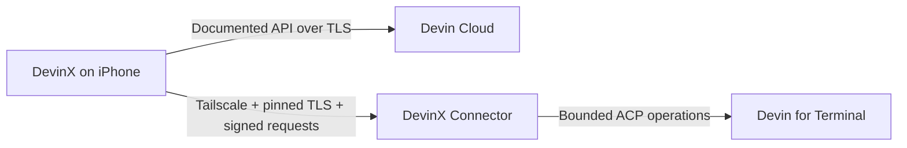

<p align="center">
  <picture>
    <source media="(prefers-color-scheme: dark)" srcset="assets/brand/wordmark-transparent.png">
    <source media="(prefers-color-scheme: light)" srcset="assets/brand/wordmark-onlight.png">
    
  </picture>
</p>

<p align="center"><strong>Run and steer supported Devin work from your iPhone.</strong></p>

<p align="center">
  <a href="https://testflight.apple.com/join/KBD25apN"><strong>Join the TestFlight beta</strong></a>
  ·
  <a href="https://github.com/fenner888/Devinx/releases/latest"><strong>Download DevinX Connector</strong></a>
  ·
  <a href="docs/devinx-connector.md"><strong>Computer setup guide</strong></a>
</p>

<p align="center">
  <a href="https://github.com/fenner888/Devinx/actions/workflows/ci.yml"></a>
  <a href="LICENSE"></a>
  <a href="https://testflight.apple.com/join/KBD25apN"></a>
</p>

> [!IMPORTANT]
> DevinX is an independent, unofficial client for Devin. It is not affiliated with, endorsed by,
> or a product of Cognition AI. Devin, Cognition, and third-party model names and marks belong to
> their respective owners. Cloud features require the user's own Devin account and appropriate API
> access.

## Release status

| Product                        | Current release | Availability                                                                                      |
| ------------------------------ | --------------- | ------------------------------------------------------------------------------------------------- |
| **DevinX for iPhone**          | `0.1.0 (73)`    | [External TestFlight beta](https://testflight.apple.com/join/KBD25apN) · up to 100 testers        |
| **Public App Store version**   | `1.0`           | Submitted to Apple and waiting for App Review · manual release after approval                     |
| **DevinX Connector for macOS** | `0.1.2`         | [Signed and notarized Apple-silicon release](https://github.com/fenner888/Devinx/releases/latest) |

TestFlight access does not include a Devin account or shared Devin data. Each tester connects their
own Devin organization, pairs a computer they control, or uses both.

## What DevinX is

DevinX is mobile mission control for supported Devin Cloud and Devin for Terminal workflows. It is
built for the moments when you are away from your desk but still need to start work, check progress,
answer a question, or review a result.

- **Start work remotely.** Create supported Cloud or Computer sessions with the context exposed by
  the selected destination.
- **See sessions in one place.** Cloud and paired-computer sessions remain clearly labeled so their
  trust and data boundaries never blur.
- **Keep work moving.** Read bounded history, send steering messages, and respond when a session
  needs input.
- **Use the real available catalog.** Repositories, workspaces, playbooks, Knowledge, attachments,
  modes, and models come from documented Cloud APIs or the live local ACP catalog—not hardcoded
  guesses.
- **Speak detailed prompts.** On supported iOS 26 devices, dictation is transcribed on device. The
  optional **Organize prompt** preview uses Apple Foundation Models when available and falls back to
  deterministic on-device formatting.
- **Inspect supported product surfaces.** Depending on account permissions, DevinX can expose
  Automations, Usage, Review, repository Wiki content, read-only integration/MCP status, and genuine
  `code_scan` Security Work.
- **Keep a helpful companion nearby.** The DevinX companion reflects session state without becoming
  an operating-system overlay or covering primary controls.

## Choose where Devin runs

| Mode                 | Connects to                                           | Required setup                                                        |
| -------------------- | ----------------------------------------------------- | --------------------------------------------------------------------- |
| **Devin Cloud**      | Documented Devin Cloud APIs over TLS                  | DevinX, a Devin organization ID, and a scoped service-user credential |
| **Computer**         | Devin for Terminal sessions on a computer you control | DevinX, Tailscale, Devin for Terminal, and DevinX Connector           |
| **Cloud + Computer** | Both sources in one app with explicit origins         | Both setups above                                                     |

Cloud authentication does not pair a computer. Computer pairing does not copy Devin credentials to
the iPhone. Each connection has its own authentication, permissions, storage, and revocation path.



DevinX operates no relay for normal Cloud or Computer session traffic.

## Install on iPhone

1. Install Apple's [TestFlight](https://apps.apple.com/app/testflight/id899247664) app.
2. Open the [DevinX Early Access link](https://testflight.apple.com/join/KBD25apN).
3. Install Build `0.1.0 (67)` and complete the in-app onboarding.
4. Choose **Devin Cloud**, **Computer**, or **Cloud + Computer**.

### Cloud setup

Cloud mode requires an existing Devin organization and a least-privilege service user created by
that organization. Enter the service-user key and organization ID only inside DevinX onboarding.
The credential is validated directly against Devin and stored with device-only protection in iOS
Keychain.

Do not paste Devin credentials into issues, screenshots, setup prompts, shell history, or chat
messages. TestFlight does not provide a shared Devin credential, and no tester receives access to
another user's sessions through the beta link.

## Install DevinX Connector on macOS

Connector is optional. Cloud-only users do not install it.

### Requirements

- macOS 13 or later on Apple silicon
- [Tailscale](https://tailscale.com/download/mac) on the Mac and iPhone, signed into the same tailnet
- Devin for Terminal installed and authenticated on the Mac
- DevinX on the iPhone

### Setup

1. Download the signed DMG and checksum from the
   [latest official DevinX release](https://github.com/fenner888/Devinx/releases/latest).
2. Verify the checksum published with that release.
3. Open the DMG and move **DevinX Connector** to Applications.
4. Open Connector and confirm it detects both Tailscale and Devin for Terminal.
5. In DevinX, open **Settings → Computers → Add Mac/PC**.
6. Scan the short-lived code and approve the named iPhone plus its requested permissions on the Mac.

The iPhone onboarding also includes a guarded assisted-setup prompt for an AI assistant on the Mac.
It uses only the official signed release, verifies the published checksum, and stops when a release
or trust check is unavailable. macOS still requires visible user approval; the iPhone app cannot and
does not silently install a desktop application.

For detailed installation, update, uninstall, development, and notarization information, read
[docs/devinx-connector.md](docs/devinx-connector.md).

## Why Tailscale is not enough

Tailscale and Connector provide two separate required layers for Computer mode:

1. **Tailscale provides private network reachability** between the iPhone and Mac.
2. **Connector provides the trusted local service** that talks to Devin for Terminal, authenticates
   each iPhone, enforces its permissions, and returns bounded results.

A Tailscale IP, server URL, or shared password is not a Devin session service. Without compatible
software listening on the Mac, there is nothing for the phone to authenticate to or request sessions
from. DevinX uses short-lived QR pairing so every phone gets its own cryptographic identity,
permission set, and revocation path instead of sharing one reusable password.

## Computer permissions and lifecycle

Connector grants are per iPhone and enforced on the Mac:

- **Read session titles and history**
- **Send messages to sessions**
- **Create new sessions**

The Mac owner chooses these permissions during pairing and can revoke a phone later. The iPhone can
request signed revocation while Connector is reachable. If the Mac is offline, DevinX offers an
honest local-only removal instead of claiming the Mac-side grant was revoked.

Closing the Connector window leaves its visible menu-bar service running. **Quit DevinX Connector**
stops it. Launch at login is an explicit user choice. Connector includes no root daemon, public
tunnel, analytics SDK, or silent updater.

## Security and privacy

- Cloud service-user credentials stay in iOS Keychain with device-only protection.
- Computer credentials remain on the computer and are never copied to the iPhone.
- Connector identity, TLS material, and paired-device grants stay in macOS Keychain.
- Every protected Connector request is authenticated, replay checked, rate limited, Zod validated,
  and authorized server-side. Unauthorized resource access receives a generic non-disclosing error.
- Computer transport pins the Connector certificate and signs requests with a per-install iPhone
  key.
- Raw dictation audio is processed on device, is not uploaded by DevinX, and is not retained after
  transcription.
- Session content, transcripts, credentials, and QR payloads are excluded from analytics and logs.
- Disconnecting wipes credentials, protected caches, drafts, templates, and remembered session
  context from the iPhone.
- Version 1 ships no product-analytics, crash-reporting, or remote-push SDK.

Read the complete [Privacy Policy](PRIVACY.md), [Security Policy](SECURITY.md),
[Authorization Matrix](docs/authorization-matrix.md), and
[latest dependency audit](docs/dependency-audit-2026-07-15.md). Report vulnerabilities through
[GitHub's private vulnerability reporting](https://github.com/fenner888/Devinx/security/advisories/new),
never through a public issue containing sensitive details.

## Honest capability boundaries

DevinX exposes only behavior supported by the authenticated account and a documented Cloud API,
official Devin MCP tool, or approved local ACP capability.

- Cloud availability depends on organization tier and service-user permissions. Missing access is
  shown as unavailable; it is not bypassed with browser cookies, private endpoints, or human-account
  impersonation.
- **Security Work** opens genuine top-level sessions whose canonical origin is `code_scan`. It is
  not Cognition's enterprise findings dashboard and does not invent a scan-creation endpoint.
- Wiki and integration/MCP surfaces are read-only where the official Devin MCP exposes them.
- Computer workspaces and models come from the live local catalog. Exact identifiers are preserved
  when dispatching work.
- Local tool approvals, arbitrary file access, arbitrary shell commands, public tunnels, and shared
  server passwords are outside the Connector grant model.
- Personal profile/OAuth settings, plan and invoice management, organization administration, and
  unsupported Web-only mutations remain owned by Devin Web.
- The initial mobile release is iPhone-only. Android and iPad are not supported. Connector `0.1.2`
  supports Apple-silicon Macs; Windows, Linux, and Intel Mac packages are planned but unavailable.

The maintained parity inventory is in
[specs/033-cloud-local-settings-parity.md](specs/033-cloud-local-settings-parity.md).

## Development

### Requirements

- Node.js `24.18.0` (pinned in `.nvmrc` and `package.json`)
- Xcode and CocoaPods for native iOS builds
- macOS for Connector release checks
- A configured Expo/EAS development environment

```bash
git clone https://github.com/fenner888/Devinx.git
cd Devinx
npm ci --legacy-peer-deps
npm run ci
```

Native voice, camera, Keychain, certificate-pinning, and pairing modules require a native development
or TestFlight build. Expo Go is not the release test environment.

### Common commands

| Command                          | Purpose                                                |
| -------------------------------- | ------------------------------------------------------ |
| `npm run start`                  | Start the Expo development server                      |
| `npm run ios`                    | Build and run the native iOS app                       |
| `npm run lint`                   | Run ESLint with zero warnings                          |
| `npm run typecheck`              | Run strict TypeScript validation                       |
| `npm run test`                   | Run the Jest suite serially with open-handle detection |
| `npm run build`                  | Validate app TypeScript and build the Connector bridge |
| `npm run audit`                  | Fail on high or critical dependency findings           |
| `npm run ci`                     | Run the complete repository CI gate                    |
| `npm run connector:build:macos`  | Build a local macOS Connector artifact                 |
| `npm run connector:verify:macos` | Verify the packaged Connector artifact                 |

No package may be added until it is verified in the official registry, including its publication
history, download history, and source repository. Dependencies are lockfile-enforced; never use a
guessed package name.

## Architecture

```text
src/app/                 Expo Router screens
src/components/          UI and interaction components
src/api/devin/           Cloud API and MCP clients, Zod schemas, endpoint contracts
src/auth/                Keychain credentials and connection providers
src/lib/                 Product rules, voice, polling, diagnostics, and utilities
src/cache/               Protected Cloud read cache
modules/                 Reviewed native iOS modules
bridge/                  Authenticated local Connector service
connector/macos/         Native macOS application
specs/                   Product and security source of truth
docs/                    Setup, parity, threat-model, and release evidence
tests/                   Unit, integration, security, and UI contract tests
```

Start with the [Build Specification](specs/000-build-spec.md),
[Connector Guide](docs/devinx-connector.md),
[Authorization Matrix](docs/authorization-matrix.md), and [AGENTS.md](AGENTS.md).

## Contributing

The specification is the source of truth. Update the relevant spec before changing a supported
product or trust boundary. Contributions must preserve:

- server-side authorization for every protected route;
- Zod validation at every external input boundary;
- generic `404` non-disclosure for unauthorized resources;
- rate limits on authentication and write paths;
- Keychain or secure-store credential handling;
- no hardcoded secrets or auth tokens in browser storage;
- verified, lockfile-enforced dependencies; and
- dependency, secret, authorization/IDOR, dead-code, artifact, and physical-device release gates.

Before opening a pull request:

```bash
npm run ci
git diff --check
```

Use public issues for ordinary bugs and feature requests. Never include credentials, QR payloads,
private session content, repository secrets, or exploit details.

## Support

- [Open a bug or feature request](https://github.com/fenner888/Devinx/issues)
- [Report a vulnerability privately](https://github.com/fenner888/Devinx/security/advisories/new)
- [Read the privacy policy](PRIVACY.md)
- [View DevinX releases](https://github.com/fenner888/Devinx/releases)

## License and trademarks

Original DevinX software and documentation are available under the [MIT License](LICENSE). See
[NOTICE](NOTICE) for third-party dependencies, names, model-provider marks, screenshots, reference
material, and trademark boundaries.

The MIT License does not grant permission to use the DevinX name or branding as a trademark or to
imply affiliation with Cognition AI, Devin, or any model provider.
